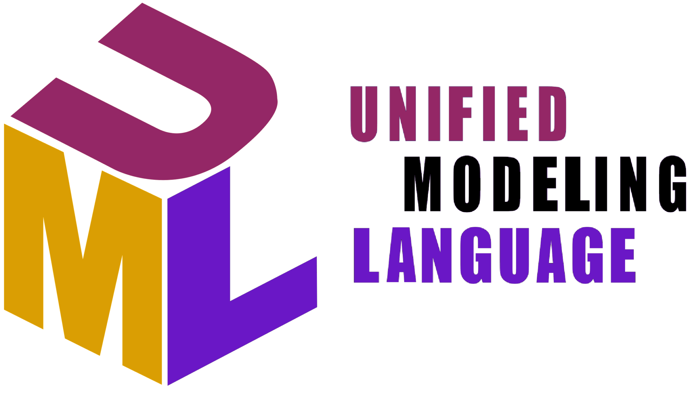

# MODELAGEM-DE-DADOS-UML

Curso Modelagem Conceitual com Diagrama de Classes da UML - Udemy

A UML é uma linguagem-padrão para a elaboração da estrutura de projetos de software. Ela poderá ser empregada para a visualização, a especificação, a construção e a documentação de artefatos que façam uso de sistemas complexos de software.