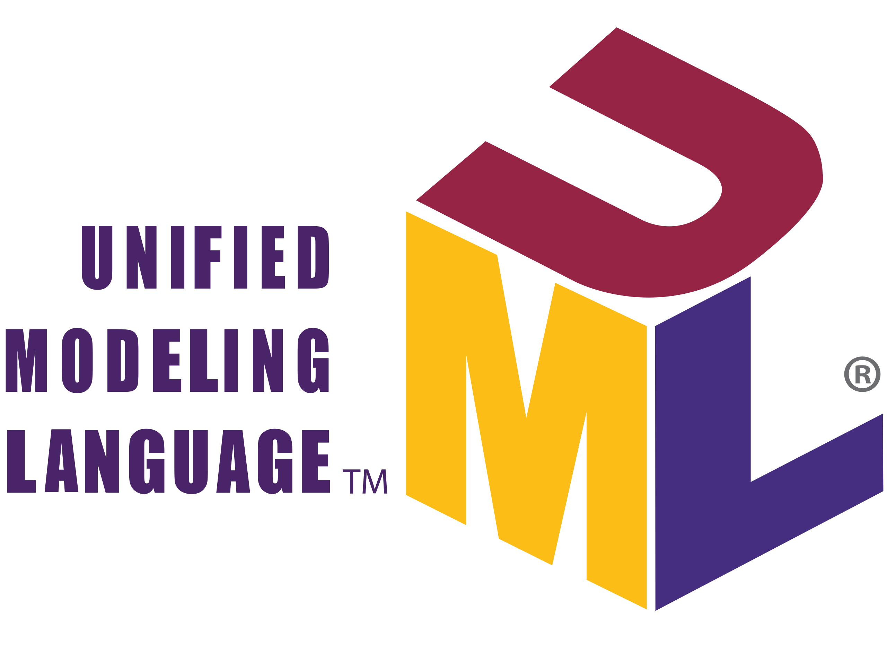
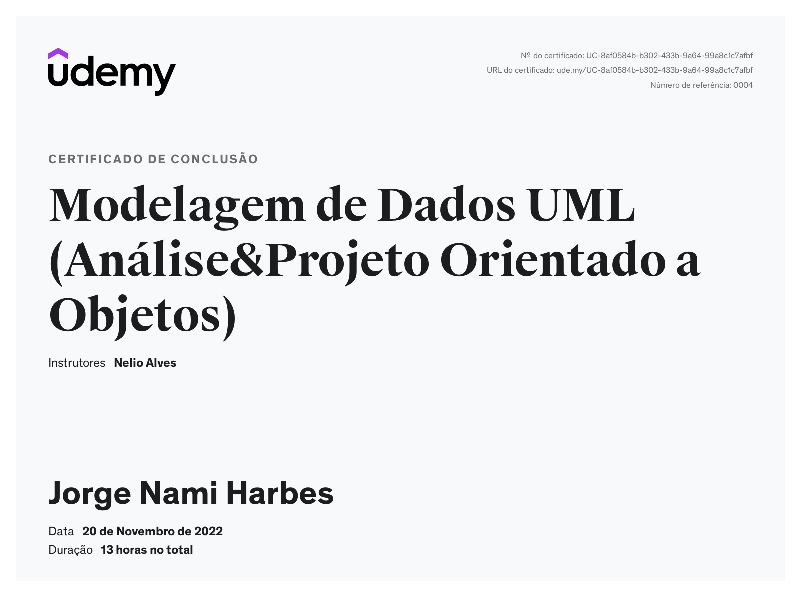

# MODELAGEM-DE-DADOS-UML

<h3>Curso Modelagem Conceitual com Diagrama de Classes da UML - Udemy</h3>
 

A <strong>UML</strong> é uma linguagem-padrão para a elaboração da estrutura de projetos de software. Ela poderá ser empregada para a visualização, a especificação, a construção e a documentação de artefatos que façam uso de sistemas complexos de software.

<strong>Java</strong> é uma linguagem de programação orientada a objetos desenvolvida na década de 90 por uma equipe de programadores chefiada por James Gosling, na empresa Sun Microsystems. Em 2008 o Java foi adquirido pela empresa Oracle Corporation.

<strong>Programação orientada a objetos (POO, ou OOP segundo as suas siglas em inglês)</strong> é um paradigma de programação baseado no conceito de "objetos", que podem conter dados na forma de campos, também conhecidos como atributos, e códigos, na forma de procedimentos, também conhecidos como métodos. Uma característica de objetos é que um procedimento de objeto pode acessar, e geralmente modificar, os campos de dados do objeto com o qual eles estão associados.

O <strong>Spring</strong> é um framework open source para a plataforma Java criado por Rod Johnson e descrito em seu livro "Expert One-on-One: JEE Design e Development". Trata-se de um framework não intrusivo, baseado nos padrões de projeto inversão de controle e injeção de dependência.

 
<h2 align="center">### Curso finalizado com os seguintes dados de certificado: ###</h2>

<ul>
<li>Código da credencial: 	UC-8af0584b-b302-433b-9a64-99a8c1c7afbf</li>
<li>URL da credencial: 		https://ude.my/UC-8af0584b-b302-433b-9a64-99a8c1c7afbf</li>
</ul>
 

